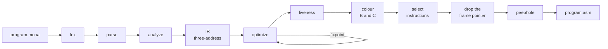

# monac

**A compiler for the 16-bit Assembly Simulator.** Mona is a small C-like language, and
`monac` turns it into assembly for the educational simulator used in the Systems course
— four registers, 4 KB of RAM, a text display at `0x1000`, and a graphics card on I/O
ports.

```c
word gcd(word a, word b) {
    while (b != 0) {
        word r = a % b;
        a = b;
        b = r;
    }
    return a;
}

word main() {
    return gcd(1071, 462);
}
```

```
$ monac gcd.mona -o gcd.asm
```

Paste `gcd.asm` into the simulator, press Assemble and Run, and `A` holds 21.

**Start with [the Mona guide](https://mrggvg.github.io/monac/)**: installing, the whole
language, the graphics card, reading the compiler's messages and writing fast code, on
one page.

## Why this exists

This project was born out of curiosity.

To pass the Systems course I wrote assembly for this simulator by hand, and most of it
was a fight with details that had nothing to do with the idea I was trying to express:
the stack pointer sits one byte *below* the top of the stack, so every frame offset is
odd; there is no `MOD` instruction; `MUL` takes one operand and uses `A` without
saying so; `[D - 2]` with spaces is a syntax error while `[D-2]` is fine. Ever since
then I kept wondering how it would have been if I had made a compiler for it instead.
What would a C-like language look like on a machine this small? How close could a
compiler get to the assembly I was writing by hand, and what would building one teach
me about the machine?

monac is how I found out. It grew into a real compiler — structs, pointers, recursion,
interrupts, a register allocator and an optimizer — but it is still meant to be read.
Every stage can be dumped, and the assembly it writes is commented, so you can write an
idea in Mona and then see exactly what it costs on the machine:

```bash
monac program.mona --dump-tokens    # what the lexer saw
monac program.mona --dump-ast       # the parsed structure
monac program.mona --dump-ir        # three-address code, before any machine detail
monac program.mona -o - -O0         # the obvious translation
monac program.mona -o - -O1         # what the optimizer makes of it
```

Every instruction on this machine costs one clock tick, so comparing `-O0` with `-O1`
shows exactly what an optimization is worth. Across the test corpus it is **54% fewer
instructions**.

## Quick start

You need a JDK 21 or newer and Maven.

```bash
git clone https://github.com/mrggvg/monac.git
cd monac
mvn package                                           # builds target/monac.jar
java -jar target/monac.jar examples/1-basics/simple.mona --stats
```

That writes `examples/1-basics/simple.asm`; paste it into the simulator. The guide's
[Getting started](https://mrggvg.github.io/monac/#start) has the rest — an alias so you
can type `monac`, speed settings, and your first program on the display — and
[docs/building.md](docs/building.md) covers the build and the tests.

## The language at a glance

| | |
| --- | --- |
| **Types** | `void`, `byte`, `word`, `sbyte`, `sword`, pointers, arrays of any rank, `struct`, `union`, `enum` |
| **Declarations** | `const` (a constant when its value is), `static` locals, initializer lists, globals holding addresses |
| **Literals** | all of C's integers — decimal, `0x`, octal, `0b`, C23 separators, `u`/`l` suffixes — characters with C's escapes, and strings |
| **Expressions** | all of C's operators at C's precedence, `++`/`--`, casts, `?:`, the comma operator, `sizeof` |
| **Statements** | `if`/`else`, `while`, `do`/`while`, `for`, `switch`, `break`, `continue`, `goto`, `return` |
| **Functions** | recursion, prototypes, function pointers |
| **Builtins** | ports (`__in`, `__out`), interrupts, the graphics card (`__vwrite`, `__vread`, `__vfill`, `__waitframe`), the keypad, a heap, strings and memory, fixed-point `__sin`/`__cos` |

No floating point, because the machine has none; fixed point covers what it would be
for. [docs/reference/language.md](docs/reference/language.md) is the language in full —
every form with a working example, and every claim in it compiled and run by the tests.

## Examples

Twelve programs in [examples/](examples/), in the order worth reading them:

| | |
| --- | --- |
| [1-basics](examples/1-basics/) | a first function, Euclid's algorithm, and a little of everything |
| [2-hardware](examples/2-hardware/) | the graphics card's ports, a keyboard interrupt, a stopwatch on the timer |
| [3-graphics](examples/3-graphics/) | a scrolling landscape, a rotating 3D cube, a name in lights |
| [4-data](examples/4-data/) | a binary search tree from a pool of nodes, and a linked list on the heap |
| [5-games](examples/5-games/) | Snake, with tiles, sprites and the keypad |

Each one runs on the simulator unchanged and is run by the test suite, and four have
walkthroughs next to them.

## Documentation

| | |
| --- | --- |
| [The guide](https://mrggvg.github.io/monac/) | learn the language and the tools, on one page ([source](docs/index.html)) |
| [Language reference](docs/reference/language.md) | every form, every builtin, and the traps |
| [The machine](docs/reference/machine.md) | the calling convention, the frame, and what the hardware will and will not do |
| [Grammar](docs/reference/Mona.g4) | the syntax, as a grammar |
| [A tour of monac](docs/tour.md) | the long version of this README: structs, hardware, memory, the heap, interrupts, testing |
| [Optimization](docs/design/optimization.md) | what each pass does and what it is worth, measured |
| [Coverage](docs/design/coverage.md) | what of the machine the compiler uses, and what it does not |
| [Roadmap](docs/design/roadmap.md) | what is done, what is not, and what was declined and why |
| [Building and testing](docs/building.md) | the build, the test suites, and the simulator they run on |

## How it works



A hand-written lexer and parser, type checking, three-address IR, an optimizer run to a
fixpoint (constant folding, copy propagation, dead code, loop-invariant code motion and
more), Chaitin-Briggs register allocation over `B` and `C`, and a set of passes over the
assembly. The first argument travels in `B` and the result comes back in `A`. The
[tour](docs/tour.md#how-it-works) has the detail, and
[optimization.md](docs/design/optimization.md) the measurements.

## How it is tested

The end-to-end tests do not compare assembly text. They load the simulator's **own**
assembler and CPU headlessly under Node, run the compiled program, and check the
registers, the display and video memory — so a passing test is evidence about the real
machine. Every test program runs at both `-O0` and `-O1` and the two must agree, and a
fuzzer generates whole programs and checks them against a reference interpreter.

662 tests: 279 unit and 383 run on the simulator.

## Status

It works, and everything above is tested. What it does not do:

- One file per program: no separate compilation, no preprocessor, no `typedef`.
- No floating point, and structs are passed by pointer rather than by value.
- Only the first argument travels in a register.
- Nothing in the runtime is re-entrant; the compiler warns when an interrupt handler
  and the program could both allocate.

[docs/design/roadmap.md](docs/design/roadmap.md) says why for each, and what is next.

## License

Public domain, under [The Unlicense](LICENSE). Copy it, fork it, change it, sell it —
anything, commercially or not, with or without credit. It comes with no warranty of any
kind, and no one is liable for anything it does.
