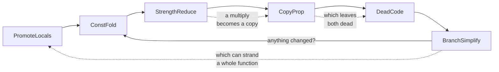

# What the optimizer does, and what it is worth

Every instruction on this machine costs **exactly one clock tick**, and memory access
is free — the CPU charges one tick per `step()` regardless. So instruction count *is*
cycle count, and a smaller program is a proportionally faster one. There is no
separate speed metric to trade against size.

## Measured

Across all 75 end-to-end programs, comparing `-O0` with `-O1`:

```
TOTAL                     4541  2078   -54.2%
```

A representative spread:

| program | -O0 | -O1 | |
| --- | --- | --- | --- |
| `comparisons` | 96 | 7 | −92.7% |
| `compound_assign` | 90 | 7 | −92.2% |
| `unary_not` | 39 | 7 | −82.1% |
| `continue_in_for` | 47 | 16 | −66.0% |
| `while_sum` | 41 | 14 | −65.9% |
| `break_continue` | 60 | 24 | −60.0% |
| `primes` | 84 | 38 | −54.8% |
| `hello_display` | 66 | 33 | −50.0% |
| `gcd` | 46 | 23 | −50.0% |
| `recursion_fib` | 56 | 26 | −53.6% |
| `array_sum` | 90 | 51 | −43.3% |
| `switch_with_calls` | 137 | 83 | −39.4% |
| `struct_list` | 276 | 195 | −29.3% |

The 90%-plus cases are programs that fold almost entirely to a constant. The floor is
set by programs dominated by call sequences and by stores: `switch_with_calls` is six
functions' worth of `PUSH`/`CALL`/`ADD SP`, and `struct_list` is mostly writes to the
heap. Neither is something an optimizer removes — a store that a program means is a
store, and the whole-corpus figure drifts down as more programs like them are added.
That is the figure being honest rather than the optimizer getting worse.

Reproduce with `Main --stats` at each level; it reports the instruction count directly.

## Passes, in order

**Across the module**, once before the function passes and once after: `DeadSymbols`
deletes every function, global, string and jump table the program cannot reach from
`main`, along with the runtime helpers and the heap that only dead code needed. Twice,
because folding a condition to a constant can leave the only call to a function in a
block that branch simplification then removes.

**On the IR**, run to a fixpoint because they feed each other — strength reduction
turns a multiply into a copy, copy propagation forwards it, dead code deletes both:



| pass | what it does |
| --- | --- |
| `PromoteLocals` | declared variables become virtual registers, so the allocator can see them at all |
| `ConstFold` | unsigned 16-bit evaluation, matching the machine exactly |
| `StrengthReduce` | powers of two — see the caveat below |
| `CopyProp` | block-local; without SSA there is no safe way to know which definition reaches a merge. A temporary copied into a variable is forwarded as the variable, so the two can share a register |
| `DeadCode` | pure definitions only; a call stays even when its value is discarded |
| `BranchSimplify` | threads jumps through empty blocks, drops what folding made unreachable |
| `LoopInvariantMotion` | a `Bin` or `Un` whose operands a loop never changes, moved into a preheader — in a loop with no call, only while it still fits two registers |

One assembly rule is worth naming alongside these because it fires on every one of
them: a conditional branch over a jump becomes the opposite branch. Lowering emits the
true edge as a branch and the false edge as a jump, so whenever the true edge is the
next block the jump is the only instruction going anywhere:

    JZ  .taken          becomes       JNZ .skipped
    JMP .skipped
  .taken:                             .taken:

Twenty-four instructions across the corpus, which understates it — it is one
instruction off every `if`, loop test and short-circuit, so it is worth most inside a
loop. When it was found, it fired five times in `cube.mona`'s inner loop and took a
frame from 27,790 instructions to 26,485; that loop has since been rewritten, and the
rule now fires in whatever conditionals a program does have.

**Then** liveness, an interference graph, and Chaitin-Briggs colouring over `B` and
`C`, followed by `FramePointerElimination` — which needs the peephole to have run
first, since removing a redundant load can be what empties a frame — and three
assembly passes: the peephole again, `FoldLoads`, and `DeadMoves`.

## Reachability is a size optimization, and size is the scarce thing

The corpus does not move at all when `DeadSymbols` is switched on: every function in a
curated test suite is called by something. That is not the case a student is in. A
helper written before it is used, an experiment left behind, a division that turned out
to be unnecessary — each of those costs RAM the stack was going to need, and the
machine has 4 KB of it in total.

The shape that costs most is an allocation in unreachable code, because `__alloc` pulls
in the whole allocator *and* a heap region sized to whatever is left over:

```
sword dead_divide(sword a, sword b) { return a / b; }
word  dead_allocate(word n) { word* p = __alloc(n); __free(p); return 1; }
word  main() { return 7; }

-O0   314 instructions, plus a heap
-O1     7 instructions, no heap
```

Reachability follows three kinds of edge: a call, the address of a function — which is
how `__setisr(&onKey)` installs a handler nothing ever calls — and a runtime helper,
which is an ordinary call in the IR and so needs no special case. Data is judged
afterwards, against the functions that survived, which is what makes it transitive.

The pass stands down under `--no-entry`, where the functions are the deliverable and
there is no program to be reachable from, and at `-O0`, which stays a literal
translation of what was written.

## Four counterintuitive findings

**Strength reduction buys no speed here.** `MUL 2` and `SHL x,1` are both one tick,
and `MUL WORD` is the *smaller* encoding. It earns its place for two other reasons:
`MUL`/`DIV` read and write `A` implicitly, so every one of them forces the value
through the accumulator while a shift writes wherever the value already lives; and
`x % 2^k` collapses to a single `AND` instead of the six-instruction sequence a
general remainder needs on a machine with no `MOD`.

Commutative operations are canonicalised so a constant operand ends up on the right,
where every rule looks for it. Without that, `x * 8` became a shift while `8 * x`
kept its multiply — the same expression compiling differently depending on which way
round it was typed.

**Spilling is nearly free.** ALU instructions take a memory source operand, so
`ADD A, [D-3]` costs exactly what `ADD A, B` costs. A spilled value read as an
operand costs nothing at all; only spilled *destinations* and repeatedly reloaded
values cost anything. This is what makes an allocator with two colours still
worthwhile, and it is why the naive code generator was never as bad as it looked.

**A struct member is free, and a global struct member is not.** `[reg+n]` takes a
displacement, so a member of a local struct folds into the frame offset and `p.y` is
one instruction, the same as a plain local. `[label]` takes no displacement — `[g_s+2]`
is a syntax error on this machine — so a global struct's members go through a register
first, exactly as a global array's elements already do. The asymmetry is the
assembler's, not a choice.

**Almost nothing needs a frame pointer.** A frame pointer exists so that one
displacement names a variable however far the body has since pushed the stack down.
But the compiler emitted every instruction that moves `SP` and knows how far each one
moves it, so it can work that displacement out itself. `FramePointerElimination`
tracks the stack depth through the body — a small dataflow, because a label reached
two ways has to agree — and rewrites `[D+k]` to `[SP+k-2-depth]`. Four instructions
per function disappear, and `D` is never touched:

| | |
| --- | --- |
| corpus with the frame pointer kept wherever `SP` moves | 1686 instructions |
| corpus with the depth tracked instead | 1554 instructions |
| **difference** | **132 instructions, 7.8%** |

(Measured on the 66-program corpus of the day; it has grown since, but the change did
not.)

`&local` looked like the exception, and this file said so for a long time: it seemed
to want a register holding a base that does not move, and `SP` is not one. It needs no
such register. An address is a value computed once, at a point where the depth is
known, so `MOV A, D` and the `SUB A, k` after it become `MOV A, SP` and one `SUB` of
the `SP`-relative displacement — the same two instructions, and one when that
displacement is zero. It had been expected to cost an instruction per address, which
would have made it a loss for any function taking two. The 30 functions that kept a
frame pointer for it lost three instructions each, 0.84% of the corpus, and no
compiled function keeps one now.

This is also where the *obvious* version of the idea fails. Keeping the frame pointer
in a global instead of a register looks attractive, because ALU instructions combine a
register with a memory operand at no extra cost. The addressing modes say otherwise —
verified against the assembler rather than reasoned about:

```
MOV A, [g_fp-2]        Error: Invalid number format: g_fp-2
MOV A, [[g_fp]-2]      Error: MOV does not support these operands
MOV B, [g_fp]          works, but that is a register again, and two instructions
MOV A, [B-2]
```

There is `[label]` with no displacement and `[reg±k]` where the base must be a
register. A memory-resident frame pointer would cost an extra instruction at every
frame access to load itself back into a register. Not moving the frame pointer
anywhere — deleting it — is the version that works.

## More registers: measured three times, declined three times

The allocator colours over `B` and `C`. `A` is the accumulator and the scratch; `D`
is the frame pointer. Freeing either would give a third colour, and the question comes
back regularly enough to be worth settling with numbers rather than intuition.

**How much spilling is there to remove?** Across the corpus, of 1715 virtual
registers:

| colours | values spilled | functions with any spill |
| --- | --- | --- |
| `B`, `C` — today | 139 (8.1%) | 48 of 167 |
| plus `D` | 86 (5.0%) | 37 |
| plus `D` and `A` | 59 (3.4%) | 30 |

A third colour removes 53 spills, which sounds worth having. It is not, and this is
the measurement that matters — instruction counts with frame-pointer elimination
switched off in every arm, so that the only difference is spill traffic:

| | |
| --- | --- |
| two colours | 2441 instructions |
| three colours | 2433 |
| **difference** | **8 instructions, 0.33%** |

Fifty-three fewer spilled values buy **eight instructions**. Of 85 programs, 19 change
at all and **five get worse** — `switch_in_loop` by 11 instructions, `struct_array` by
8 — because more colours changes the simplify order, which changes what gets coalesced,
and the new choice is not always better.

Freeing `D` would also mean deciding before instruction selection whether a function
keeps a frame pointer, and emitting `SP`-relative frame addresses from the start,
because a function cannot both use `D` as a value and address its frame through it.
That is a restructure of the back end for 0.33%. (Since `&local` stopped needing a
frame pointer, no compiled function keeps one, so the deciding would now be trivial.
The selection would not, and the 0.33% stands.)

Even four colours — `A` as well, which is unsound without modelling every place the
selector needs the accumulator — buys 43 instructions, 1.8%, and that is an optimistic
upper bound measured without those constraints.

The reason is the machine property at the top of this file, and it deserves stating
plainly: **a spill costs almost nothing here.** `ADD A, [SP+3]` is one tick, exactly
what `ADD A, B` costs, so a spilled value that is only read is free. What a spill
actually costs is the single store when it is defined — and half of those are storing
a value that the next instruction folds back out of memory anyway.

## Where the moves actually are

With the frame pointer gone and the first argument in a register, the mix looks like
this:

| | | |
| --- | --- | --- |
| `MOV`/`MOVB` | 1827 | 42.2% |
| — touching memory | 885 | 20.4% |
| — **register to register** | **942** | **21.8%** |
| `PUSH`/`POP`/`CALL`/`RET` | 613 | 14.2% |
| arithmetic and logic | 579 | 13.4% |
| branches | 365 | 8.4% |
| stack adjustment | 193 | 4.5% |

Register-to-register moves are the largest single item, and more registers would not
remove one of them: they are values in the wrong register, not values with nowhere to
go. Breaking them down by shape pointed straight at the biggest one, `MOV B, A`, and
at where those come from — two thirds followed an `ADD` or a `SUB`, meaning a value
had been computed in the accumulator and then moved to where it lived.

That turned out to be one missing rule. When the destination's register already holds
the *right* operand, computing there would clobber it before it is read, so the
selector fell back to `A`:

```
   MOV A, [SP+3]        instead of        ADD B, [SP+3]
   ADD A, B
   MOV B, A
```

Addition does not care which way round its operands are. Turning `b = x + b` into
`b = b + x` makes the left operand the one already in place and both moves disappear.
Only for the commutative operations, of course: `x - b` is not `b - x`.

Worth **24 instructions**, three times what a third register buys, from twenty lines
in the instruction selector rather than a restructure of the back end. `MOV B, A` fell
from 169 to 116.

**Where the cost actually is**, measured across the corpus:

| | |
| --- | --- |
| `MOV`/`MOVB` | 40% |
| `PUSH`/`POP`/`CALL`/`RET` | 21% |
| everything else | 39% |

So data movement, not register pressure. `FoldLoads` and `DeadMoves` target it
directly and together saved 63 instructions — 2.6 times what allocating `A` would
have — with no correctness risk from unmodelled fixed registers.

## The static count is not the whole story

Every figure above is a *static* instruction count, which is the right measure for
whether a program fits in 4 KB and a decent proxy for speed. It is a poor proxy for
one thing: a call inside a loop.

Passing the first argument in a register rather than on the stack cuts 70 instructions
from the corpus, 3.5%. Measured by what actually executes, it cuts **15.3%**:

| | executed instructions |
| --- | --- |
| arguments all on the stack | 39,415 |
| the first one in `B` | 33,370 |
| **difference** | **6,045, 15.3%** |

The gap is the whole point. `recursion_fib` is 30 instructions shorter and runs 5,917
fewer — because those 30 are inside a function called 1,973 times.

| program | executed before | after | |
| --- | --- | --- | --- |
| `mutual_recursion` | 114 | 83 | −27.2% |
| `recursion_factorial` | 135 | 99 | −26.7% |
| `nested_calls` | 39 | 30 | −23.1% |
| `recursion_fib` | 29,596 | 23,679 | −20.0% |
| `void_call` | 12 | 10 | −16.7% |
| `strength_reduce` | 71 | 60 | −15.5% |

Eighteen programs got faster, forty-eight did not change, and eight got **one or two
instructions slower**: those either take a parameter's address, which forces the
register argument into memory after all, or call a signed-arithmetic helper, which now
stores its first argument to a slot because its body uses `B` as scratch throughout.
Both costs are real and both are where they should be — paid by the functions that
incur them rather than by every call.

## Why the first argument and not the first two

There are four registers. `A` is the accumulator, the scratch and the return value;
`D` is the frame pointer. That leaves `B` and `C` as the colours, so passing two
arguments in registers would leave a two-argument function with no allocatable
register at all on entry, and every temporary it computed would spill. One argument
in `B` leaves `C` free, which is what makes the leaf case actually free:

```c
word add(word a, word b) { return a + b; }
```
```asm
m_add:  ADD   B, [SP+3]
        MOV   A, B
        RET
```

Nothing special-cases this. The argument arrives as an `ArgIn` instruction defining an
ordinary virtual register; the allocator then decides whether it can stay in `B` — a
leaf function, free — or has to be written to a frame slot because the function makes
a call of its own and `B` will not survive it. The only addition to the allocator is a
*preference*: colour that value `B` if `B` is free, and leave `B` alone for it if you
are its neighbour and have another choice. A preference, never a constraint — being
denied it costs one move, and spilling costs more than that.

## The heap: three allocators, and a claim I got wrong

The allocator began as an implicit free list — a two-byte header per block, bit 0
meaning available, first fit, and `free` walking the whole heap to re-merge adjacent
blocks. It became two bitmaps over two-byte units. It is now **three allocators, and
the compiler picks one by looking at the whole program**:

| tier | when | `capacity` | `churn` |
| --- | --- | --- | --- |
| **bump** | the program never calls `__free` | 10,483 | — |
| **slab** | it frees, and every `__alloc` asks for the same constant | — | 35,245 |
| **bitmap** | anything else: mixed or dynamic sizes | 63,518 | 94,648 |
| *free list, for reference* | | *1,504,970* | *71,419* |

Everything measured on the two programs in this table: `capacity.mona` allocates
six-byte objects until the heap says no, and `churn.mona` allocates two and frees two,
two hundred times.

| | free list | bitmap | tiers |
| --- | --- | --- | --- |
| `heap.mona` | 3,140 steps, 706 B | 2,591, 1,089 B | **1,336, 760 B** |
| `tree.mona` | 3,035, 983 B | 3,171, 1,293 B | **1,999, 815 B** |
| `capacity.mona` | 444 objects, 284 B | 476, 621 B | **615, 143 B** |
| `churn.mona` | 71,419 steps, 599 B | 94,648, 979 B | **35,245, 650 B** |

The free-list column is from the commit before the bitmap landed; the other two are
one build, taken after the codegen fixes in `AddressOfIT`, which is why they differ
slightly from the figures in the commits that introduced them.

### The claim I got wrong

The bitmap commit said the free list's problem was that `free` re-merged the whole
heap, and cited `capacity.mona`'s 1.5 million steps as the evidence. **`capacity.mona`
never calls `__free`.** The quadratic it measured was in *`alloc`* — first fit walked
every block from the base on every call — and what fixed it was the hint, not the
bitmap. The two changes shipped together and I attributed the win to the wrong one.

Measuring a program that actually frees says the rest of it. On `churn.mona` the
bitmap is **33% slower than the free list it replaced**, because a list's granularity
is a block and a bitmap's is a unit: finding and marking three units costs more than
walking a short list of blocks. That regression was in the tree the whole time and no
benchmark was pointed at it.

### Why a compiler can do what C cannot

Every fast C allocator answers the same way — **size classes**, so that allocation is
a pop rather than a search. glibc has 62 bins and a per-thread cache; musl groups
same-size slots behind a bitmap; tcmalloc and jemalloc keep per-thread free lists.
None of them can choose at compile time, because `malloc` is a library compiled once
for callers it will never see.

We are not a library, and two things are visible here that are not visible to C:
whether the program ever frees, and what sizes it asks for. `DeadSymbols` already
computes the first; constant folding turns `__alloc(sizeof(struct Node))` into
`MOV B, 6` before the second is asked. So:

- **bump** — the frontier moves and that is the entire data structure. No metadata, so
  the whole region is data rather than eight ninths of it, and the allocator's own
  code comes back as heap: `capacity.mona`'s image falls from 621 bytes to **143**,
  which is most of why 476 objects becomes 615. This is region allocation, which C
  programmers do by hand precisely because their compiler cannot do it for them.
- **slab** — the bitmap with the unit made equal to the object. One bit per cell
  instead of one per two bytes, so there is a single bit to find and a single bit to
  set rather than a run of them, and the scan leaves the word and mask in registers so
  marking is three instructions.
- **bitmap** — unchanged, and now reached only by programs that allocate more than one
  size. It is the general case and the backstop the other two are checked against.

A free list threaded through the free cells would beat the slab — a pop and a push —
but it is what makes a double free silent in C, and a bit per cell keeps that
detectable. `HeapIT` has a case for it.

### Three allocators, one contract

That is the risk this creates, and the least-used implementation is the one that rots.
So `--heap-strategy bump|slab|bitmap|auto` forces the choice, and every behavioural
test in `HeapIT` runs under all three — 13 cases times 3 tiers. A program that cannot
meet a tier's precondition falls back to the bitmap rather than failing, which is what
makes asking for all three of everything safe.

### Inlining the fast path: measured, and declined

Once the bump allocator is frameless it is eight instructions, and two more are the
`CALL` and the `RET`. That is a 25% overhead on the routine, which sounds worth
removing — and the compiler can remove it, because unlike C we own both sides of the
call. `tree.mona` and `heap.mona` each compile to a single `CALL rt_alloc`, so
inlining would duplicate nothing.

Hand-inlining the sequence at that one call site, with the constant size folded in:

| | call | inlined | |
| --- | --- | --- | --- |
| `capacity.mona` | 10,483 steps, 143 B | 9,265, 138 B | **−11.6%** |
| `tree.mona` | 1,999 steps, 815 B | 1,979, 810 B | **−1.0%** |

It is a win at both ends and it is five bytes *smaller*, because the helper goes away.
It is still not worth building. The whole saving is the `CALL` and the `RET` — two
instructions per allocation — so the 11.6% belongs to a loop whose entire body is an
allocation, and a program that does anything with what it allocates sees 1%. Against
that: expanding a call into an inline sequence lives in the instruction selector, needs
a unique label per site, and has to stay correct through frame-pointer elimination and
the peephole. That is the most delicate part of the compiler, for one percent.

The bar here has been consistent — a third colour was declined at 0.33% and register
`A` at 1.6% — and this sits inside it. The difference is that those cost bytes as well
as time, and this one does not; if the selector ever grows the ability to expand a call
for another reason, this is the first thing to put through it.

### Where the 4,096 bytes actually go

The tiers moved the question. Filling the heap with six-byte objects, same program,
three allocators:

| | image | allocator | metadata | **objects** |
| --- | --- | --- | --- | --- |
| bump | 143 B | ~30 B | none | **615** |
| slab | 387 B | ~274 B | 1 bit each, ~70 B | **563** |
| bitmap | 621 B | ~508 B | 2 bits a unit, ~143 B | **476** |
| *free list* | *284 B* | *~140 B* | *2 bytes each, ~1,230 B* | *444* |

The free list's two-byte header was never the small cost it looks like: at 444 objects
it is 1.2 KB, a third of the machine. That is what the bitmap was for, and what the
bump tier removes entirely.

But the budget for the bump tier reads 143 image, **256 stack reserve**, 3,697 heap —
and that program provably needs *twenty* bytes of stack. `stackReserve()` is
`max(bound + 16, 256)`, so the floor applies even where the bound is exact, and the
comment on `STACK_RESERVE` says the heap gets the difference where the code says it
does not. Two hundred and twenty bytes held back is **36 objects**; the whole bump
allocator costs five. The allocator is no longer what costs a program its heap.

Left alone deliberately, because the floor is the margin protecting a bounded program
from `StackDepth` being wrong, and a bounded program gets no run-time stack guard.

### Two shapes that look better than they measure

- **Rounding mixed sizes up to one cell**, so more programs reach the slab. Break-even
  needs the average waste under about 0.8 bytes an object: four-and-six mixed sits
  exactly on the line, four-and-eight loses. The cliff to the general allocator is
  roughly where it should be.
- **Wider bitmap units.** Four-byte units halve the metadata and cost up to three
  bytes an object: a six-byte object goes from 6.25 bytes to 8.125. Two-byte units are
  right for the objects this machine holds.

Two size classes sharing one region is the one place glibc's design does not port at
all: it can rebalance because it has virtual memory, and a static split of three
kilobytes wastes more than the general allocator ever would.

### What each step actually cost

- **The first bitmap was 2.4× slower than the free list.** Scanning one bit at a time
  with a call to the bit-address helper per bit is worse than walking a list of
  blocks. Whole-word shortcuts (`CMP A, 0` finds sixteen free units, `CMP A, 65535`
  skips sixteen busy ones) fixed the large requests and did nothing for small ones.
- **The hint was the fix, and it is not a policy change.** `alloc` remembers the
  lowest unit that could possibly be free; every unit below it is provably in use, so
  first fit from zero would examine exactly the same units. It is the known-busy
  prefix memoized. `heap.mona` 6,417 → 3,555.
- **Zeroing the bitmaps at startup was a tenth of `heap.mona` and unnecessary.** The
  simulator hands over zeroed memory: a fresh `MemoryCell` holds zero, reset writes
  zero to every cell outside a device region, assembling stores only the image over
  the bytes the image occupies, and a halted CPU cannot be restarted without that same
  reset. The loop was overwriting zeroes with zeroes. `heap.mona` 2,903 → 2,591. A
  machine that did not promise this would need the loop back, so the dependency is
  written down in `Runtime.HEAP_INIT_BODY`.


## Two copies that were not the limit of SSA

`e = e - dy` lowers to a subtraction into a temporary and a copy back into `e`, and in
`cube.mona`'s inner loop both of its updates stayed three instructions — into a scratch,
the operation, copy back. It looked like the textbook case of a copy that cannot be
coalesced across a back edge without SSA. The minimal loop coalesced fine, which is
what gave it away. Two things were in the way, neither of them the loop:

- **Copy propagation kept the temporary alive.** The test after the update read the
  temporary rather than `e`, so the two were live at once and could never share a
  register. A copy from a temporary defined once into a variable assigned many times is
  now forwarded the other way. Not for a variable live across a call, which is in
  memory regardless — there, reading it costs a load reading the temporary did not.
- **The coalescer's safety test counted every neighbour.** Briggs' test is about
  neighbours of significant degree; counting all of them, with two colours, refuses
  nearly any merge in a busy loop. And since Briggs fails anyway in a loop keeping many
  values live, George's test is tried as well: a temporary living inside a variable's
  range has no neighbour the variable does not already have.

A frame of `cube.mona` went from 15,448 steps to 13,958, drawing the same pixels;
across 111 programs, 1.2% fewer instructions and 1.3% fewer steps.

## Known limits

- A third register, as above: 0.33%, and five programs get worse. Reconsider only if
  the instruction mix shifts far enough that spilled *destinations* dominate.
- Inlining the allocator's fast path: 1.0% on a real program, 11.6% on a loop that
  does nothing else, and five bytes smaller — declined for the machinery it needs in
  the instruction selector, not for the numbers.
- Parameters are never promoted to registers. They are read as memory operands, which
  is one tick, so the gain would be limited to values read several times.
- Only the *first* argument travels in a register; the rest are still pushed. A second
  one would need a third allocatable register to be worth having — see above.
- The peephole forgets every remembered memory location at any store, since a store
  through a pointer could land anywhere, and everything at a label. Telling which
  stores can alias would need the IR's view of pointers, which the assembly no longer
  has.
- Loop-invariant code motion stops at register pressure. In a loop that calls nothing
  it hoists only while the loop still fits in two registers: unrestricted, it moved
  `r * 10` and `r << 3` out of an inner loop that fitted, pushed its counter to memory,
  and made it slower.
