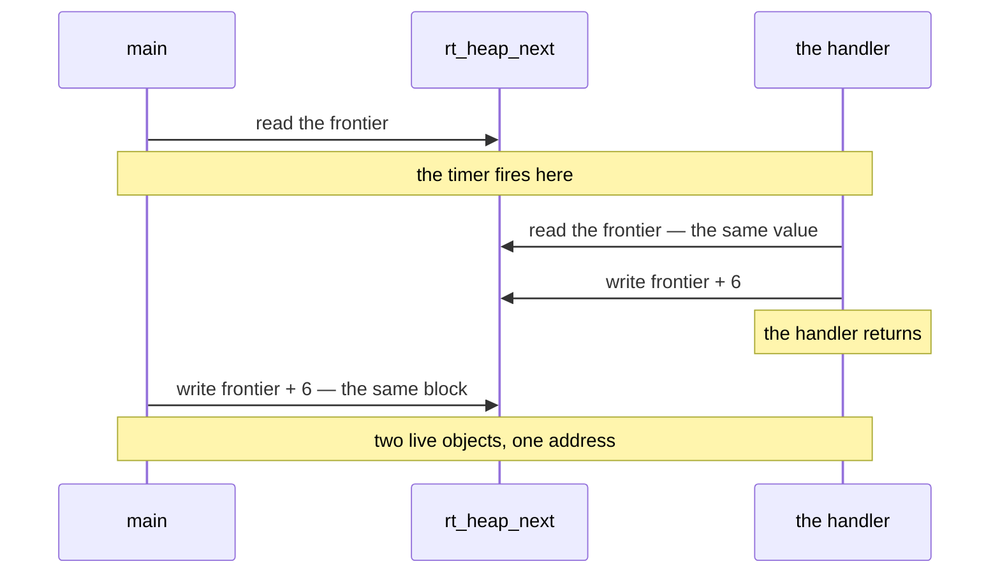

# Target machine notes

## Why the frame offsets are odd

This is the thing that makes the machine feel upside down. Its `PUSH` writes the
word at `SP-1` and *then* lowers `SP` by two, so **`SP` addresses the next free
byte, one below the top-of-stack word**:

```js
pushWord(v) { storeWord(SP - 1, v); SP -= 2; }   // top word is at [SP+1]
popWord()   { v = loadWord(SP + 1); SP += 2; }
```

So `MOV A, [SP+1]` reads the top of the stack, not `MOV A, [SP]`. Every frame
offset inherits that one-byte skew and comes out odd.

## Calling convention

Verified by executing it on the real simulator.

**Argument 0 travels in `B`.** It is never pushed, so it has no place in the frame at
all; a function that needs it in memory — because something takes its address, or
because it must survive a call of its own — writes it to a slot like any other value.
Everything else is pushed, and the result comes back in `A`.

```asm
f:      PUSH D          ; save the caller's frame pointer
        MOV D, SP       ; D = frame base
        SUB SP, 4       ; reserve locals, 4 bytes here
        ; ... body ...
        MOV SP, D       ; drop locals
        POP D           ; restore the caller's frame pointer
        RET
```

Relative to `D`:

| Location            | Contents                                      |
| ------------------- | --------------------------------------------- |
| `[D+1]`             | saved caller `D`                              |
| `[D+3]`             | return address, pushed by `CALL`              |
| `[D+5]`, `[D+7]`, … | arguments **1** and up, argument 1 nearest    |
| `[D-1]`, `[D-3]`, … | local slots, including argument 0 if it needs one |

The caller pushes arguments 1 and up in reverse (so argument 1 ends up nearest), puts
argument 0 in `B` **last** — after every push, because a push touches only `A` and
`SP` and so cannot disturb it — `CALL`s, and reclaims the pushed ones with
`ADD SP, <argbytes>`. A one-argument call touches the stack not at all.

Because the displacement is a signed byte, a frame can address 64 local word slots
and 62 arguments. The compiler reports going over rather than letting the assembler
complain about an offset out of range. The same signed byte is why a struct is capped
at 127 bytes: a member past that could not be named from a base register at all.

**The frame pointer is usually not emitted.** The layout above is what the compiler
reasons in, not what it prints. A frame pointer exists to give the body one
displacement that holds still however far the stack has since been pushed down — and
the compiler emitted every instruction that moves `SP`, so it can work that
displacement out itself and address the frame from `SP` directly:

```asm
m_add:  MOV   A, [SP+3]     ; the first argument
        ADD   A, [SP+5]
        RET
```

Across the test corpus no compiled function keeps one. Taking the address of a local
does not need one either: `&x` is computed once, where the depth is known, as `SP`
plus a displacement. See [../design/optimization.md](../design/optimization.md).

> **Superseded idea.** An earlier version of this file popped the return address
> into `C` at the top of the function and pushed it back before `RET`, on the theory
> that it was in the way. It is not: `MOV SP, D` followed by `POP D` leaves it
> exactly where `RET` expects it. The epilogue is three instructions, not six.

## Things the machine will not let you write

- **No `MOD` instruction.** `a % b` becomes `a - (a / b) * b`.
- **`MUL` and `DIV` take one operand** and use `A` implicitly as both source and
  destination: `MUL B` means `A = A * B`. There is no `MUL A, B`. Both are unsigned
  and there is no high half of the product.
- **No spaces inside indirect operands.** `[D-2]` assembles; `[D - 2]` is a syntax
  error.
- **No negative immediates.** `MOV A, -5` is rejected; emit `65531`.
- **Memory is never an ALU destination.** `ADD [D-1], A`, `INC [D-1]` and
  `PUSH [D-1]` are all rejected. Results come back through a register.
- **`CALL` takes a label or `[reg]`, never a bare register.**
- **Labels** are uppercased (so `foo` and `Foo` collide), may not spell a register
  name, and may not begin with an underscore. Every user symbol is mangled.

## Things it *will* let you write, which are worth exploiting

- **ALU instructions take a memory source operand.** `ADD A, [D-3]`, `CMP A, [D+5]`,
  `DIV [D-5]` and `MUL 10` are all legal and cost one clock tick, the same as the
  register forms.
- **`MOV [D-1], 5` stores an immediate straight to memory**, so `word x = 5;` is a
  single instruction.
- **Every instruction takes exactly one tick**, so instruction count is cycle count.

That combination is why reading operands out of frame slots is nearly free, and why
memory-operand folding matters more here than register allocation does.

## What the memory looks like

4128 bytes altogether: 4096 of RAM, then the 32-byte text display at `0x1000`. Inside
the RAM, three things share one space with nothing between them:

```
0x0000  image: code, then globals, strings and jump tables
        heap, if the program allocates          -- grows up
        ... free ...
0x0FFF  stack                                   -- grows down
0x1000  the 32-byte text display
```

**Nothing detects a collision.** A stack that grows into the code overwrites it, and
the machine's first complaint is `Invalid opcode` at some unrelated address; run far
enough past that and `SP` wraps below zero and it becomes
`Memory access violation at -1`. Both arrive long after the evidence is gone. That is
why the compiler computes the stack requirement up front where it can, and checks at
run time where it cannot.

**RAM arrives zeroed, and that is depended on.** A fresh `MemoryCell` holds zero, the
simulator's reset writes zero to every cell outside a device region, and assembling
stores only the image over the bytes the image occupies — it never touches what is
above. A halted CPU cannot be restarted without that same reset, either, so the region
above the image really is zero every time a program gets control. The allocators
therefore do not clear their own metadata: on `heap.mona` that loop was a tenth of the
whole run, spent overwriting zeroes with zeroes.

## Addressing, exactly

Two forms, and the difference decides more design than it looks like it should.

| form | takes a displacement? |
| --- | --- |
| `[reg]`, `[reg+n]`, `[reg-n]` | yes, `n` a signed byte |
| `[label]` | **no** |

`[g_state+2]` is not a tighter way to write something — it is a syntax error,
`Invalid number format: g_state+2`. So anything reaching past the first word of a
global goes through a register first, which is why a global array's elements and a
global struct's members are addressed the same way, and why keeping a frame pointer
in memory instead of a register does not work.

There is **no alignment requirement**: `loadWord(addr)` reads `addr` and `addr + 1`
whatever `addr` is. Structs are therefore packed with no padding at all, and
`{ byte flag; word value; }` really is three bytes with the word at an odd offset.

## The peripherals, in the same spirit

- **Ports are a separate space.** `IN`/`OUT` take a port as an immediate or from a
  register and **nothing else** — no memory operand. A port number kept in a variable
  costs a load, and with every register busy the compiler frees one by pushing it, so
  `__out(8, …)` is three instructions cheaper per write than `__out(VIDADDR, …)`.
- **Video memory is its own 64 KB** that no pointer in the program can reach; the only
  way in is `VIDADDR`/`VIDDATA`. In bitmap mode it is 256×256 at one byte per pixel,
  so the address is `y * 256 + x` and fits a word exactly. An out-of-range write wraps
  inside video memory and cannot corrupt the program.
- **`VIDMODE 3` clears the whole screen in one instruction.** Writing those 65,536
  pixels by hand would be 131,072. In tile mode it clears only the 32 KB map, which is
  what makes it usable per frame: the tile definitions, palette, scroll registers and
  sprites all survive it.
- **Mode 1 is a tile engine, and nothing in this compiler uses it yet.** The same
  64 KB becomes a 128×128 map of redefinable 16×16 tiles — 2048 pixels square — behind
  a window that scrolls a pixel at a time, plus a programmable 256-entry palette,
  eight transparent sprites, and 23,754 bytes the card never reads. Two `OUT`s move
  the whole viewport, against four instructions per pixel in bitmap mode, so anything
  that scrolls is orders of magnitude cheaper there. [language.md](language.md) documents
  the layout; `TileModeIT` pins it against rendered pixels.
- **Video memory reads back.** Writing `VIDADDR` pre-loads `VIDDATA` from that
  address, so `__out(8, at); __in(9)` is a two-instruction load out of a 64 KB space —
  and in tile mode the region above `0xA326` is never rendered. That is 23,754 bytes
  of usable storage attached to a machine with 4,096.
- **The timer counts instructions, not time.** `TMRPRELOAD` loads a counter that falls
  by one per instruction and raises IRQ 1 at zero, then reloads — so interrupts arrive
  every `preload + 1` instructions, and a second is however many the simulator runs
  per second.
- **The graphics card is the only real clock.** While the display is on it raises
  IRQ 2 every 20 ms of wall time — 50 Hz, independent of the simulator's speed
  setting, which is exactly what the instruction-counting timer cannot give you.
  It can also be *polled* — `IRQMASK` has to carry the bit or the controller drops the
  trigger, but the CPU need never be told to deliver it — so `__waitframe` waits for a
  frame with no handler, no vector and no `STI`.
- **The keypad is level-triggered, and the other two are not.** Reading `KBDDATA`
  lowers the level; `IRQEOI` clears the status bit. `IRQEOI` is `status ^= value`
  followed by `status |= level`, so acknowledging *before* reading the data puts the
  bit straight back and the handler runs twice for one keypress — no hang, no fault,
  just a doubled counter. It also means acknowledging a line that is not raised
  **sets** it, so a handler must write back what it read rather than a constant.
- **There is no DMA, and no transfer of any kind.** Ports 0 to 10 are the whole
  machine. Every byte that reaches the card goes through one `VIDADDR`/`VIDDATA` pair,
  so a kilobyte of tile shapes is a few thousand instructions — worth doing once at
  setup, never per frame. `__vwrite`/`__vread`/`__vfill` are that loop, written once,
  and they branch on `VIDMODE` because a `VIDDATA` write moves two bytes in tile mode
  and one in bitmap.
- **`MUL` throws half the product away, and it is recoverable.** Four byte-wide
  multiplies and the carries between them rebuild the high 16 bits in about thirty
  instructions — `__mulhi`. That is what makes fixed point at a scale above 128
  possible; `cube.mona` predates it.
- **One interrupt vector at `0x0003`,** shared by every device, so a handler reads
  `IRQSTATUS` to find out who called. Delivery needs both the device's bit in
  `IRQMASK` and the global mask via `STI`; the handler must acknowledge through
  `IRQEOI` or `IRET` returns straight into the still-raised request.
- **A handler cannot interrupt itself.** Entering one clears `SR.irqMask` and `IRET`
  restores it, so handlers do not nest unless the handler enables them again. That is
  what makes the compiler's warning about allocating in a handler exact rather than
  cautious: one side allocating is safe, and it takes allocation on the handler side
  *and* on the program side for the two to collide.

Nothing in the runtime is re-entrant, and the allocators least of all. Each reads a
word, decides from it, and writes it back:



Reproduced rather than reasoned about: a loop allocating with a timer handler that
also allocates collides within a few thousand instructions, and `InterruptSafetyIT`
pins it. The fix is `__cli()` and `__sti()` around the program's own allocations,
which is where it belongs — inside the allocator it would cost every program two
instructions a call and would silently re-enable interrupts for one that had turned
them off on purpose.
