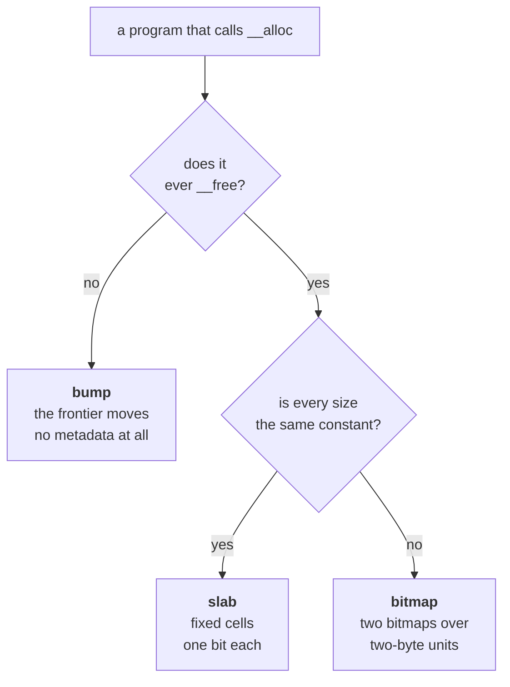
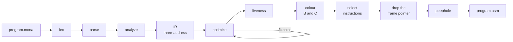

# A tour of Mona and monac

The long version of the README: what the language has, how it reaches the hardware,
how the compiler handles memory, the heap and interrupts, how all of it is tested, and
how the compiler is put together. The [guide](https://mrggvg.github.io/monac/) is the
place to learn the language; this is the place to see why it is the way it is.

## The language

| | |
| --- | --- |
| **Types** | `void`, `byte` (u8), `word` (u16), `sbyte` (i8), `sword` (i16), pointers `T*`, arrays `T[N]` and `T[N][M]` with any constant length, `struct`, `union`, `enum` |
| **Qualifiers** | `const` at every level C allows it, checked and costing no code; `static` locals |
| **Literals** | all of C's: `42`, `0xFF`, `017`, `0b1011`, `1'000`, `10u`, `'A'`, `'\101'`, `"text"` |
| **Operators** | `+ - * / %`, `& \| ^ ~ << >>`, `== != < <= > >=`, `&& \|\|` (short-circuit), `!`, unary `-`, `&` and `*`, `++`/`--` prefix and postfix, `(type)` casts, `?:`, the comma operator, `[]`, `.` and `->`, `sizeof` |
| **Assignment** | `=` and all ten compound forms (`+=`, `<<=`, …); assignment is an expression, so `a = b = 0` works |
| **Statements** | `if`/`else`, `while`, `do`/`while`, `for`, `switch`/`case`/`default`, `break`, `continue`, `goto`, `return`, nested blocks |
| **Functions** | multiple functions, parameters, **recursion and mutual recursion**, forward references, prototypes checked against their definitions, function pointers with checked signatures |
| **Globals** | file-scope variables whose initializers are numbers, or the addresses of strings, globals and functions |
| **Initializers** | `{ ... }` lists for arrays, structs and unions, nested or flat as C allows; a string for a byte array; `[]` counted from the list |
| **Comments** | `//` and `/* */` |
| **Builtins** | `__in`, `__out`, `__sti`, `__cli`, `__setisr`, `__alloc`, `__free`, `__vwrite`, `__vread`, `__vfill`, `__waitframe`, `__mulhi`, `__ticks`, `__getkey`, `__halt`, `__memcpy`, `__memset`, `__strlen`, `__strcpy`, `__strcmp`, `__sqrt`, `__sin`, `__cos`, `__fixmul`, `__random` |

Recursion is real, not simulated: `fib(15)` runs 23,679 instructions across thousands
of nested frames and returns with the stack exactly balanced. A frame there is six
bytes — the return address and two locals, with no saved frame pointer and no pushed
argument — so about 660 of them fit in the RAM left over.

No floating point: the machine has none, and fixed point — `__fixmul`, `__sin` and
`__cos` — covers what it would be for. Declined: `typedef` and a preprocessor.
[design/roadmap.md](design/roadmap.md) has the order and the reasons.

### Structs

```c
struct Node {
    word value;
    struct Node* next;      // a struct may name itself through a pointer
};

struct Node* push(struct Node* head, word value) {
    struct Node* node = __alloc(sizeof(struct Node));
    if (node == 0) return head;         // the heap is full
    node->value = value;
    node->next = head;
    return node;
}
```

Declared at file scope, written `struct Name` at every use as in C89 — which keeps
the grammar context-free, since the parser never has to know whether an identifier
is a type. `.` reads a member, `->` reads one through a pointer, and each diagnoses
being used for the other.

**Nothing is padded.** The machine loads a word from any address, so a struct is
exactly the sum of its members and `{ byte flag; word value; }` really is three
bytes. **A member costs nothing extra**: `[D+k]` already takes a displacement, so
`p.y` is one instruction, the same as a plain local.

Structs are **not passed or returned by value** — the calling convention pushes one
word per argument and returns one in `A`, and widening that to carry a struct would
encourage copying across calls on a machine with 4 KB of RAM. A pointer is two bytes
and says what was meant; the compiler says so if you try. Whole-struct **assignment**
does work, as an unrolled word-by-word copy.

`examples/4-data/tree.mona` is a binary search tree that sorts onto the display —
a recursive type, a pool of nodes, and real recursion in 241 instructions.

### Driving the hardware

The graphics card, keypad, timer and random generator do not live in memory. They
sit in a separate **port** space, and video RAM is its own 64 KB that no pointer can
reach. `__in` and `__out` are the way in — they compile to a single instruction each:

```c
void setTile(word x, word y, byte ch, byte colour) {
    __out(8, (y * 128 + x) * 2);      // VIDADDR, a byte address; tiles are 2 bytes
    __out(9, ch * 256 + colour);      // VIDDATA: high byte char, low byte colour
}

word main() {
    __out(7, 1);                      // VIDMODE = TEXT
    setTile(0, 0, 'M', 15);
    return 0;
}
```

| port | | |
| --- | --- | --- |
| 3, 4 | `TMRPRELOAD`, `TMRCOUNTER` | timer |
| 5, 6 | `KBDSTATUS`, `KBDDATA` | keypad; reading data clears the status |
| 7 | `VIDMODE` | 0 off, 1 text, 2 bitmap, 3 clear, 4 reset |
| 8, 9 | `VIDADDR`, `VIDDATA` | the window onto video RAM |
| 10 | `RNDGEN` | a fresh random word per read |

Five builtins exist for the machine rather than the language: `__vwrite`, `__vread`
and `__vfill` move blocks between RAM and the card's 64 KB, `__waitframe` paces on the
50 Hz refresh without needing a handler, and `__mulhi` recovers the half of a product
`MUL` throws away. Each becomes a call into a runtime helper that is emitted only when
a program uses it, so an unused one costs nothing.

**Mode 1 is a tile engine, not a text mode.** Behind those three ports the card holds a
128x128 map of redefinable 16x16 tiles — 2048 pixels square — seen through a window
that scrolls over it a pixel at a time, with a programmable 256-colour palette, a
background colour, eight transparent sprites, and 23,754 bytes it never looks at.
Video memory reads back as well as writes, and while the display is on the card raises
its own 50 Hz interrupt on line 2. [reference/language.md](reference/language.md#the-graphics-card-has-64-kb-of-its-own)
has the layout and the traps; `TileModeIT` pins all of it against rendered pixels.

`examples/3-graphics/blocks.mona` draws a scrolling landscape using four glyphs out of the
card's CP437 tile ROM — blank, upper half, lower half and solid — which make every cell
two square pixels with its own colour, and upload no tile data at all.
`examples/5-games/snake.mona` is a complete game built on these — board, body, food,
collision and keyboard, in 3104 bytes. `examples/3-graphics/cube.mona` is a rotating 3D
wireframe in bitmap mode: fixed point at a scale of 128, a sine table, and perspective
division, in 1480.

### Memory, and running out of it

The machine has 4096 bytes for the image, the heap and the stack together, and no
memory protection at all. So the compiler works out in advance how much stack a
program can need — a call graph without a cycle in it has a longest path, and the
frames along it are a number:

```
$ monac snake.mona --stats
monac: 947 instructions, 3104 bytes of 4096
monac: stack at most 32 bytes, 992 bytes free
```

That number decides how much room the heap is allowed, instead of the fixed 256-byte
guess it replaced, and it makes the "does this fit" error say what is actually
needed rather than warning vaguely that things look tight.

Recursion has no longest path, so those programs get the 256-byte floor and a check:
two instructions at the top of each function that can reach itself, comparing `SP`
against the floor. Nothing else pays for it — 71 of the 75 test programs contain no
recursion and are emitted byte for byte as before.

When it fires, it says so where you can see it:

```
STACK OVERFLOW
```

written straight to the display by a routine that touches the stack nowhere, because
the stack is the thing that ran out. Without it the same program dies of
`Invalid opcode: 255`, some distance after the recursion has overwritten the code
that was going to produce the message.

### The heap

A program that calls `__alloc` gets a heap; one that does not carries neither the
region nor the allocator. Nothing to configure — the need is obvious from the source:

```c
struct Node* node = __alloc(sizeof(struct Node));   // 0 if there is no room
node->value = value;
node->next = head;
...
__free(node);
```

The heap starts at a label emitted after all code and data, so the assembler resolves
it to the exact end of the image, and its size is worked out at startup as the
distance from there to the stack reserve — always the largest heap that fits, however
big the program turned out. `--heap <bytes>` caps it if you want a hard bound.

There are **three allocators, and the compiler picks one by reading the whole
program** — which a C compiler cannot do, because `malloc` is a library compiled once
for callers it will never see.



Both preconditions come from facts only a whole-program view has: whether `__free` is
reachable, and whether `sizeof(struct Node)` is the only size anyone asks for. A binary
tree that never frees gets a bump pointer and the entire region as data; a linked list
that recycles nodes gets cells sized to the node. Everything else gets the general
allocator, which is also what the other two are tested against —
`--heap-strategy bump|slab|bitmap` forces the choice, which is how all three stay
under the same contract.

It is worth about what you would expect from not searching. A binary search tree ran
in 1,999 cycles where the general allocator took 3,171 — measured on `tree.mona` when
it still allocated its nodes; it takes them from a pool now — and a program that fills
the heap with six-byte objects fits 615 of them instead of 476 — mostly because the
allocator it no longer carries was 480 bytes of the 4,096.

`__free` checks its argument: a pointer outside the heap, misaligned, not the start of
a block, or already freed never came from `__alloc`, and instead of quietly corrupting
the heap it puts `HEAP CORRUPT` on the display and halts. Catching the double free is
why the slab spends a bit per cell rather than threading a free list through the free
cells, which would be faster and is where a good deal of C's exploitable memory
corruption comes from.

**No allocator here is re-entrant.** Each reads a word, decides from it, and writes it
back, so an interrupt landing in the middle leaves the handler working from a value
the interrupted code was about to change — and both get the same memory. The machine
masks interrupts for the duration of a handler, so a handler cannot interrupt itself
and allocating on one side alone is safe; it takes both. The compiler warns when it
can see both, and the fix is `__cli()` and `__sti()` around the program's own
allocations. Doing that inside the allocator would cost every program two instructions
a call and would silently re-enable interrupts for one that had turned them off on
purpose.

There is **no memory protection** for the heap itself. It grows up from the image and
the stack grows down from `0x0FFF`; `__alloc` returns 0 rather than overrun, and the
stack has its own guard, but nothing stops a wild pointer.
`examples/4-data/heap.mona` is a linked list.

### Interrupts

One vector at `0x0003` serves every device, so a program has one handler and works
out who interrupted it by reading IRQSTATUS. `&someFunction` yields its address, and
`__setisr` installs it at run time:

```c
void onIrq() {
    word pending = __in(1);            // IRQSTATUS
    if (pending & 1) lastKey = __in(6);// keyboard
    __out(2, pending);                 // IRQEOI — or it re-enters immediately
}

word main() {
    __setisr(&onIrq);
    __out(0, 1);                       // IRQMASK: let the keyboard interrupt
    __sti();
    ...
}
```

A trampoline at the vector saves all four registers — the CPU pushes only IP and SR —
calls through the installed address, and returns with `IRET`. It saves all four
because the handler is only known at run time, which is the price of a vector you can
change while the program runs. `examples/2-hardware/interrupt.mona` is the smallest worked
example; `examples/2-hardware/stopwatch.mona` is a real one, counting hours, minutes and
seconds off the timer interrupt and resetting on the space bar.

### Writing to the display

Thirty-two characters live at `0x1000`, one byte each. There is no driver and nothing
to initialise — it is memory:

```c
word main() {
    byte* screen = 4096;              // 0x1000, the memory-mapped text display
    byte* msg = "HELLO MONA";
    word i = 0;
    while (msg[i] != 0) {
        screen[i] = msg[i];
        i = i + 1;
    }
    return i;
}
```

## How it is tested

The end-to-end tests do not compare against expected assembly text. They load the
simulator's **own** assembler and CPU headlessly under Node and *execute* the compiled
program, then check the registers and the display:

```c
// expect: A=21
word main() { return gcd(1071, 462); }
```

That makes a passing test evidence about the real machine rather than about our
understanding of it — which matters, because several of this machine's rules are
surprising enough that we got them wrong first and only found out by running them.
`MachineContractIT` pins each of those rules as a named test.

647 tests: 266 unit, 381 executed on the simulator, including a fuzzer that generates
random expressions and compares against a reference evaluation, and a differential
suite that runs every program at both optimization levels and requires them to agree.

Two of those suites exist because the differential idea has limits. `ImageSizeIT`
checks the compiler's own byte count against the assembler's, because a figure the
compiler reports about itself is one nothing else was checking — it was under-counting
by a factor of three. And `AddressOfIT` runs at both levels deliberately: it covers
two wrong-code bugs, one that appeared at every optimization level and one that
appeared at only `-O1`, so either level alone would have missed one of them.

## How it works



- **Front end** — hand-written lexer, recursive descent for declarations and
  statements, Pratt precedence climbing for expressions. Errors carry positions and
  recover, so one run reports several problems.
- **Semantic analysis** — scopes, a flat type lattice, and type checking. `byte` is a
  storage type; arithmetic promotes to 16 bits, because the 8-bit register halves
  alias the 16-bit ones and modelling that in the allocator is not worth it.
- **IR** — three-address code over unlimited virtual registers, not SSA. Both `Cmp`
  and `Cbr` exist so a condition lowers to a compare and a branch rather than a
  materialised 0/1.
- **Optimizer** — local promotion, constant folding, strength reduction, copy
  propagation, dead code, branch simplification, loop-invariant code motion, run to
  a fixpoint; plus a
  whole-module pass that drops every function, global and runtime helper the program
  cannot reach from `main`.
- **Back end** — Chaitin-Briggs graph colouring over `B` and `C`, with Briggs and
  George coalescing, then frame-pointer
  elimination and three assembly passes: a peephole, load folding, and dead-move
  removal. No compiled function keeps a frame pointer, not even one taking a local's
  address: that is computed from `SP` at the point it is taken.
- **Calling convention** — the first argument travels in `B`, the rest on the stack,
  the result in `A`. Worth 3.5% of the corpus statically and **15.3% of what actually
  executes**, because the calls it shortens are the ones inside loops.

[design/optimization.md](design/optimization.md) has the measurements, and the findings
specific to this machine that are worth knowing:

- **Strength reduction buys no speed here.** `MUL 2` and `SHL x,1` are both one tick,
  and `MUL` is the *smaller* encoding.
- **Spilling is nearly free.** ALU instructions take a memory source operand, so
  `ADD A, [D-3]` costs exactly what `ADD A, B` costs.
- **Almost nothing needs a frame pointer.** The compiler knows how far it has pushed
  the stack at every instruction, so it can address the frame from `SP` and keep `D`
  free. `&local` included: an address is computed once, where the depth is known.
- **The allocator is no longer what costs a program its heap.** A bump-allocating
  program reserves 256 bytes of stack where it provably needs twenty: 36 six-byte
  objects, against the five the whole allocator costs.
- **Static instruction counts understate call optimizations.** Passing one argument in
  a register is 3.5% of the corpus as written and 15.3% of what runs.

The [examples](../examples/) are twelve programs that run unchanged, grouped by what
they teach, with walkthroughs of four: a stopwatch driven by the timer and keypad
interrupts, a rotating 3D cube that is entirely shaped by what the machine cannot do —
no floats, and a multiply that keeps only the low sixteen bits — a search tree built
from a pool of nodes, and a name in lights, which is where the 3-3-2 RGB palette gets
explained. [The documentation map](README.md) lists everything else.
